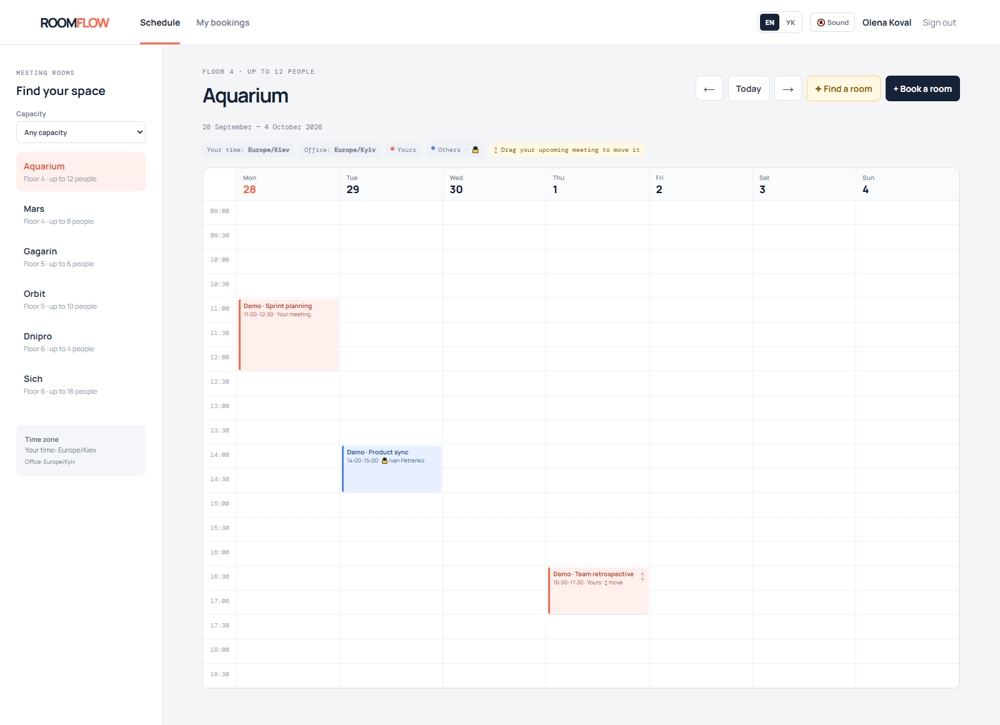
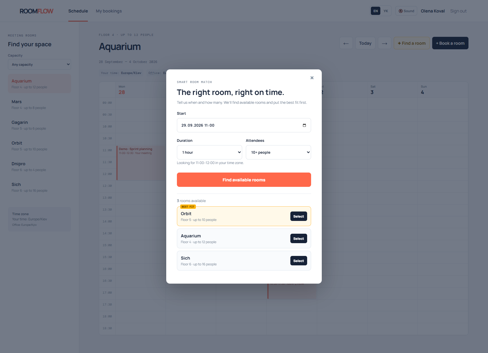
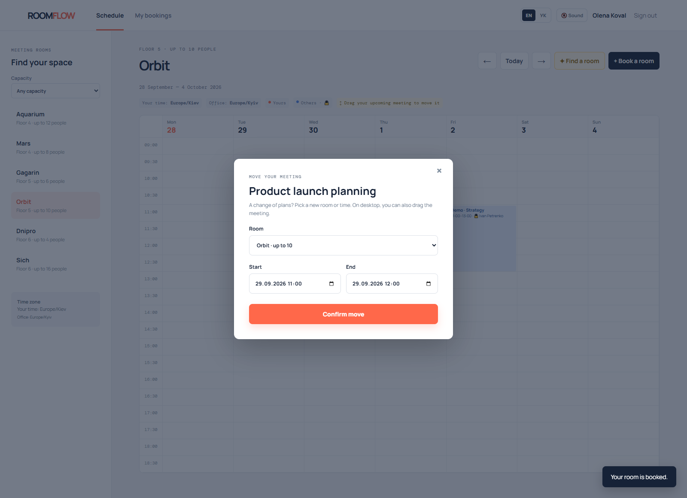
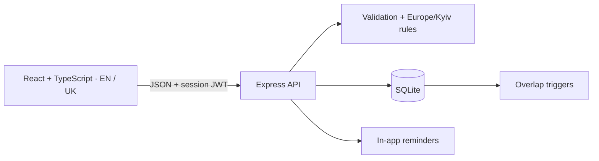

# RoomFlow — Product presentation

### Meeting rooms, made simple.

**English** · [Українська](README.uk.md)

Find the right room, book a time that works, and keep your team in sync. RoomFlow is a meeting-room booking application for workplace teams. This company product presentation includes an interactive application, a React interface, an Express API, and a SQLite database.

**English is the default language.** Switch to Ukrainian with **EN / УК** on the sign-in screen or in the app header. Your choice is remembered in your browser. Labels, dates, validation messages, reminders, and sample content support both languages. Names and meeting titles you enter yourself remain unchanged.



| Find your space | Make a confident choice | Change plans with ease |
| --- | --- | --- |
| A shared weekly calendar for six rooms | Smart Room Match ranks available rooms by capacity | Move your meeting without double-booking |
|  |  |  |

## Watch the demo

[▶ Watch the English walkthrough (MP4)](docs/demo/roomflow-showcase.mp4) · [Animated preview](docs/demo/roomflow-tour.gif) · [Presentation page — EN / УК](docs/demo/index.html)

The screenshots and recording show the actual English interface. Open `docs/demo/index.html` locally, or host it as a static page alongside the media files.

Source repository: [Theinet/RoomFlow](https://github.com/Theinet/RoomFlow).

## Try it locally

Use **Node.js 22.x**, as specified in `.nvmrc`, CI, and Docker. With nvm installed, run `nvm use` first.

```bash
npm ci
npm run build
npm start
```

Open [localhost:3000](http://localhost:3000), then select **Explore the live demo**. No email setup is needed.

| Demo account | Password |
| --- | --- |
| `olena@roomflow.dev` | `password123` |
| `ivan@roomflow.dev` | `password123` |

The first run creates the local SQLite database, six meeting rooms, two demo users, and sample bookings. The demo button signs you in as Olena. On weekends, the calendar initially opens the next working week. Sample bookings are refreshed on server startup when their previous occurrences have ended.

For development:

```bash
npm run dev
```

Vite runs at [localhost:5173](http://localhost:5173), with API requests proxied to `localhost:3000`.

## A two-minute presentation

1. Open the app in English and select **Explore the live demo**.
2. Show **Aquarium** and the weekly calendar: orange meetings belong to you; blue meetings belong to other users.
3. Select **Find a room**, choose a future time and attendee count, and run **Find available rooms**. The smallest suitable available room is marked **BEST FIT**.
4. Select a room. Its details and time slot carry into the booking form. Enter a meeting title and confirm.
5. Click your upcoming meeting to change its room, time, or duration. On desktop, you can also drag it to a free slot. Conflicts are checked by the API and database.
6. Create a weekly series, then open **My bookings** to cancel one occurrence or the entire series.
7. Switch to **УК** to demonstrate the Ukrainian interface, then return to **EN** for screenshots.
8. On a phone, show the daily agenda. Tap an available slot to book or your own upcoming meeting to move it.

Optional: turn on **Sound**. While the tab is open, upcoming meetings generate reminders; desktop notifications require browser permission. Use a meeting starting within `NOTIFY_BEFORE_MINUTES` to demonstrate this.

## What works

- Weekly room calendar and mobile daily agenda.
- Room capacity filter and server-backed Smart Room Match.
- Book, move, and cancel your own meetings.
- Weekly recurring bookings, up to eight occurrences.
- Atomic series creation: a conflict in any occurrence rejects the whole series.
- Database protection against overlapping bookings, including concurrent requests and moves.
- English and Ukrainian UI, with English presentation media.
- UTC storage, Kyiv office rules, browser-local display, and daylight-saving-aware weekly navigation.
- In-app reminders, optional sound, and optional browser notifications.
- Loading, empty, error, and retry states.
- Docker Compose, healthcheck, and GitHub Actions CI configuration.

## Smart Room Match

Provide a start time, duration, and attendee count. The API checks all rooms against the requested capacity and existing bookings, then ranks available options by the smallest excess capacity. Selecting a result pre-fills the booking form. Availability is checked again when you confirm.

## Conflict protection

SQLite triggers reject overlaps on both `INSERT` and `UPDATE`:

```text
new.start < existing.end AND new.end > existing.start
```

Adjacent meetings are allowed. The integration test `atomically resolves simultaneous requests for the same room and slot` sends two concurrent booking requests and verifies **201 + 409**, with exactly one booking stored.

```bash
npm test
```

See [ADR-001](docs/adr/001-database-conflict-guard.md) for the database decision.

## Architecture



- **Time:** ISO UTC timestamps in storage. Office hours are 09:00–19:00 in `Europe/Kyiv`; bookings use 30-minute increments and last 30 minutes to four hours. The interface displays browser-local time.
- **Authentication:** normalized email addresses, bcrypt password hashes, and signed session JWTs containing only allowed user fields. Verification tokens are not accepted as session tokens.
- **Recurring meetings:** dates retain the Kyiv wall-clock time across daylight-saving changes. All occurrences are created in one transaction.
- **Notifications:** the client polls every 15 seconds. Start reminders and end-of-meeting handoff reminders are stored separately and deduplicated by booking and kind. Notifications are marked read when fetched; delivery is not guaranteed if the response is lost or the tab is closed.
- **Moves:** ownership checks and an update trigger protect both drag-and-drop and form-based changes. Moving or cancelling a meeting clears outdated handoff reminders.
- **Localization:** the shared catalog is `src/translations.ts`; the frontend language control is `src/i18n.tsx`. API messages use `Accept-Language: en` or `uk`, defaulting to English. Demo verification pages preserve the selected language.

[Architecture overview](docs/ARCHITECTURE.md) · [UTC and office time](docs/adr/002-utc-and-office-time.md) · [Atomic series and reminders](docs/adr/003-atomic-series-and-alerts.md)

## Docker

1. Copy `.env.example` to `.env` (`Copy-Item .env.example .env` in PowerShell, or `cp .env.example .env` in a POSIX shell).
2. Set a long, random `JWT_SECRET`. Adjust `APP_URL` if you use another address.
3. Start the demo:

```bash
docker compose up --build
```

Open `http://localhost:3000`. SQLite data persists in the `roomflow_data` volume. Stop with `docker compose down`; this keeps the data volume.

The image uses Node 22, runs as a non-root user, and checks `/api/health`.

## Verification

```bash
npm test
npm run build
npx tsc --noEmit
```

Tests cover interval rules, booking creation, conflicts, ownership, recurring meetings, notifications, session payloads, token purpose, localization, and calendar-day arithmetic. Run tests in a disposable development checkout: the current API tests use the local `data/roomflow.db`.

## Presentation environment

The **product presentation environment** includes public demo credentials, automatic sample data, an openly readable schedule, and a verification link displayed after registration instead of real email delivery. These settings also apply to the supplied Docker image.

Use fictional data. A real deployment needs restricted enrollment, real email verification or SSO, private schedule access, rate limits, account recovery and revocation, tested backups, HTTPS, and operational monitoring.

## Logs and external requests

The server writes structured JSON logs to its console: request ID, method, path (without query parameters), response status, duration, startup events, verification-link creation with a user ID, and errors. Request bodies, authorization headers, and verification URLs are not deliberately logged. Inspect Docker logs with `docker compose logs -f roomflow`.

There is no integrated visitor analytics or session recording. Google Fonts supplies the typefaces, so the browser makes external font requests. The browser stores the session token, language preference, and sound preference locally. Hosting providers may have their own logs.

## License

Copyright (c) 2026 THE INET™. All rights reserved. RoomFlow is proprietary. Viewing for evaluation is permitted; other use requires prior written permission as described in [LICENSE](LICENSE). Third-party components retain their own licenses.
