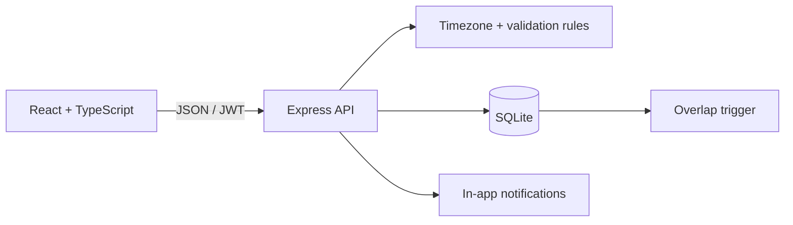

# RoomFlow — презентація продукту

[English](README.md) · **Українська**

Презентація продукту компанії для бронювання переговорних. Основна мова — англійська; перемикач **EN / УК** на екрані входу та в шапці зберігає вибір у браузері. Скріншоти й відео показують англійську версію.

RoomFlow — веб-застосунок для бронювання переговорних в офісі. Користувач бачить тижневий розклад кімнати, бронює вільний час і може скасувати лише власні зустрічі. Усі часові значення зберігаються у UTC, а інтерфейс відображає їх у часовому поясі браузера.

## Репозиторій

Репозиторій проєкту: [github.com/Theinet/RoomFlow](https://github.com/Theinet/RoomFlow)

Презентаційна сторінка: [EN / УК](docs/demo/index.html). Відкрийте файл локально або розмістіть разом із медіа на статичному хостингу.

## Візуальний walkthrough

Нижче — 26-секундний запис англійського інтерфейсу: вхід → календар → Smart Room Match → бронювання → перенесення → скасування. Вона ілюструє реальні можливості застосунку; правила доступності та конфліктів перевіряються API і SQLite, а не лише інтерфейсом.

[▶ Відкрити повне відео — англійський інтерфейс](docs/demo/roomflow-showcase.mp4)

[](docs/demo/roomflow-showcase.mp4)

| Календар переговорних | Smart Room Match | Захищене перенесення |
| --- | --- | --- |
|  |  |  |

## Швидкий старт

Потрібен **Node.js 22.x** (`.nvmrc` зафіксований на Node 22). Для чистого
clone використайте `nvm use` перед `npm ci`; це також версія, яку застосовує
GitHub Actions і Docker image. Новіші Node можуть вимагати локальні C++ build
tools для нативного SQLite-драйвера.

```bash
npm ci
npm run build
npm start
```

Відкрити [http://localhost:3000](http://localhost:3000).

Для розробки:

```bash
npm run dev
```

Vite буде доступний на [http://localhost:5173](http://localhost:5173), API — на `http://localhost:3000`.

## Архітектурні рішення

- [ADR-001 — захист від подвійного бронювання на рівні БД](docs/adr/001-database-conflict-guard.md)
- [ADR-002 — UTC у сховищі, Europe/Kyiv для офісних правил](docs/adr/002-utc-and-office-time.md)
- [ADR-003 — атомарні серії бронювань і сповіщення](docs/adr/003-atomic-series-and-alerts.md)

## Race-Safety Proof

Клієнтська перевірка — лише підказка. Фінальне правило виконує SQLite trigger:
два паралельні `POST /api/bookings` для одного інтервалу повертають рівно
`201 Created` і `409 Conflict`; у базі зберігається рівно одне бронювання.

Відтворити доказ можна однією командою:

```bash
npm test
```

Інтеграційний тест `atomically resolves simultaneous requests for the same room and slot`
перевіряє обидва HTTP-статуси та запис у БД. Деталі рішення — в
[ADR-001](docs/adr/001-database-conflict-guard.md).

## Smart Room Match

Smart Room Match приймає час, тривалість і кількість учасників, перевіряє
доступність усіх кімнат на сервері та ранжує тільки вільні варіанти за
найменшим достатнім запасом місткості. Обраний варіант одразу передається у
форму бронювання — користувачу не потрібно вгадувати вільну переговорну.

Тестові користувачі:

| Email | Пароль |
| --- | --- |
| `olena@roomflow.dev` | `password123` |
| `ivan@roomflow.dev` | `password123` |

Перший запуск автоматично створює SQLite-базу, 6 кімнат, двох тестових користувачів і демонстраційні бронювання. У вихідні стартовим показується найближчий робочий тиждень, щоб розклад одразу був живим.

На екрані входу також є кнопка «Відкрити інтерактивне демо» — вона входить під тестовим акаунтом Олени та дозволяє одразу показати готовий сценарій.

## Docker

1. Скопіювати приклад середовища: `Copy-Item .env.example .env`.
2. Вписати у `.env` довгий випадковий `JWT_SECRET` (і змінити `APP_URL`, якщо сервіс працює не на localhost).
3. Запустити:

```bash
docker compose up --build
```

Сервіс працює на `http://localhost:3000`; база зберігається в Docker volume `roomflow_data`. Для зупинки: `docker compose down`.

Структуровані runtime-логи доступні через `docker compose logs -f roomflow`; вони містять request ID, route, status та тривалість, але не містять паролів, JWT чи email-посилань.

## Перевірка

```bash
npm test
npm run build
```

Тести покривають:

- перетини інтервалів: суміжні, часткові, повний збіг, різні дні;
- API-створення, конфлікт, заборону скасування чужої броні;
- повторювані серії та одноразові сповіщення.

## Демонстраційний сценарій

1. Увійти як Олена та відкрити «Акваріум» — демо-бронювання видно в сітці.
2. Натиснути «✦ Підібрати», вказати час, тривалість і кількість людей. Smart Room Match поверне лише реально вільні кімнати та позначить оптимальний варіант.
3. Обрати варіант — форма бронювання вже матиме правильні кімнату, дату, початок і кінець.
4. Перетягнути свою майбутню червону картку в інший слот або натиснути її, щоб змінити кімнату, дату чи тривалість. Сині картки позначені замком, бо належать іншим користувачам. Конфлікт перевіряє API й SQLite trigger.
5. На телефоні відкрити компактний денний розклад: вільний слот створює бронювання, а власна картка відкриває форму перенесення.
6. Увімкнути кнопку «Звук» у шапці: відкрита вкладка покаже toast і подасть короткий сигнал перед початком зустрічі. Браузерне системне сповіщення запитується лише після явного кліку.
7. Створити бронювання або серію «щотижня, 3 рази», а потім спробувати зайняти той самий слот іншим користувачем — API поверне зрозумілий конфлікт.
8. У «Мої бронювання» скасувати один елемент серії або всю серію.

## Архітектура

Детальна карта модулів, інваріантів даних і trade-off-ів: [docs/ARCHITECTURE.md](docs/ARCHITECTURE.md).



### Ключові рішення

- **Час.** Бронювання зберігаються ISO UTC. Робочі години перевіряються на сервері за `Europe/Kyiv`; сітка перетворює офісний час у пояс браузера, з урахуванням DST.
- **Перетини й гонки.** Формула конфлікту: `start < existingEnd && end > existingStart`. Суміжні інтервали дозволені. Додатково SQLite trigger `prevent_booking_overlap` атомарно відхиляє конфліктну вставку, тому одночасні запити не створять дубль.
- **Smart Room Match.** Окремий API перевіряє місткість і перетини для всіх переговорних на конкретний інтервал, сортує результат за найменшим надлишком місткості та повертає тільки доступні варіанти. Клієнт не «вгадує» вільну кімнату.
- **Авторизація.** Email нормалізується (`trim + lowercase`), пароль хешується bcrypt, сесія — підписаний JWT. У цьому демо після реєстрації посилання підтвердження показується в інтерфейсі, без надсилання листа. До підтвердження бронювання заблоковані. Посилання діє 24 години та не є одноразовим.
- **Повторення.** Серія створюється одним транзакційним запитом; якщо зайнятий будь-який слот, не створюється жоден. Офісний локальний час зберігається при переході на літній/зимовий час.
- **Сповіщення.** Відкрита вкладка опитує сервер кожні 15 секунд. За `NOTIFY_BEFORE_MINUTES` до початку зустрічі користувач отримує один toast; за ввімкненим користувачем звуком — короткий сигнал і, за дозволом браузера, системне повідомлення. Зберігається також попередження перед завершенням, якщо наступний слот у кімнаті вже зайнятий. Вони зберігаються як різні типи (`start` та `handoff`), тому не блокують одне одного.
- **Перенесення.** Власні майбутні події перетягуються у desktop-сітці або редагуються через доступну форму (у тому числі на телефоні). Той самий API-метод і trigger захищають від конфліктів під час перенесення.

## Можливості проєкту

- Docker Compose і healthcheck;
- GitHub Actions CI;
- фільтр переговорних за місткістю;
- сторінка «Мої бронювання» з поступовим показом історії;
- щотижневі повторювані бронювання (до 8);
- демонстраційне підтвердження email без поштового сервісу;
- одноразові внутрішні сповіщення;
- Smart Room Match: підбір вільної кімнати за часом, тривалістю та місткістю;
- денний mobile-first розклад, desktop drag-and-drop і форма перенесення;
- адаптивна верстка, loading, empty та error/retry стани.

## Презентаційне середовище

Це презентаційне середовище продукту RoomFlow. Демо-акаунти, автоматичні приклади, відкритий API розкладу та посилання підтвердження без пошти доступні також у Docker. Використовуйте вигадані дані. Для реальної компанії потрібні обмеження доступу, справжнє підтвердження email або SSO, rate limiting, відновлення акаунтів, резервні копії та HTTPS.

## Дані та журнали

Сервер пише технічні JSON-журнали в консоль; вбудованої аналітики відвідувачів чи запису сесій немає. Шрифти завантажуються з Google Fonts. У браузері зберігаються токен сесії, мова й налаштування звуку.

## Ліцензія

Copyright (c) 2026 THE INET™. Усі права захищено. RoomFlow є пропрієтарним програмним забезпеченням. Перегляд для ознайомлення та оцінювання дозволено; інше використання потребує попереднього письмового дозволу відповідно до [LICENSE](LICENSE). Сторонні компоненти зберігають власні ліцензії.
