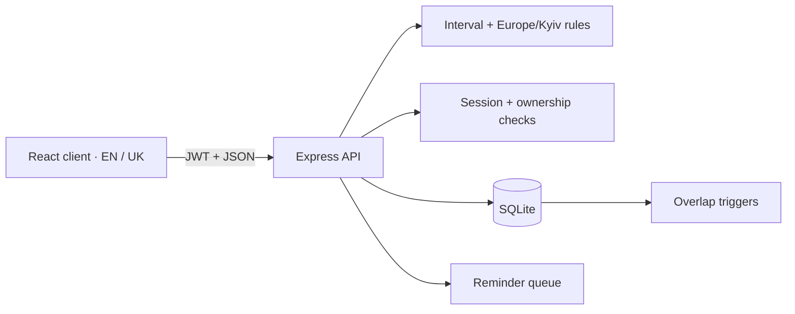

# RoomFlow architecture

**English** · [Українська](ARCHITECTURE.uk.md)

RoomFlow is a meeting-room booking application with a single-server presentation environment. The browser handles interaction; the API validates requests; SQLite enforces the final booking-conflict invariant.



## Module boundaries

| Module | Responsibility |
| --- | --- |
| `src/main.tsx` | UI state, booking flows, browser-local time display |
| `src/i18n.tsx` | Language selection, persistence, document language |
| `src/translations.ts` | Shared English/Ukrainian messages and reminder localization |
| `src/calendar.ts` | Calendar-day arithmetic across daylight-saving changes |
| `src/server.ts` | HTTP contracts, session validation, ownership, transactions |
| `src/rules.ts` | Interval validation, office hours, weekly repetition in Kyiv time |
| `src/db.ts` | Schema, additive migrations, indexes, overlap triggers |
| `src/seed.ts` | Demo accounts, rooms, and sample bookings |

## Data invariants

| Invariant | Enforcement |
| --- | --- |
| A room cannot have overlapping bookings | SQLite triggers on INSERT and UPDATE |
| Adjacent slots are allowed | `start < existingEnd && end > existingStart` |
| Only the owner can move or cancel a booking | Session middleware plus owner-scoped SQL |
| A recurring series is all-or-nothing | One SQLite transaction |
| Start and handoff reminders are independently deduplicated | UNIQUE(booking_id, kind) |

The concurrency integration test sends two requests for one slot and verifies 201 + 409 with exactly one stored row.

## Time and localization

Bookings store ISO UTC instants. Office rules use Europe/Kyiv; the client displays browser-local time. Weekly series preserve Kyiv wall-clock time across DST. Client week navigation uses calendar dates instead of fixed 24-hour blocks.

English is the default interface language. Ukrainian is selectable without signing out. The browser stores this preference and supplies Accept-Language for API messages. Demo verification links include the selected language. User-authored content remains in its original language; known sample names and titles have English display equivalents.

## Booking lifecycle

1. The client sends a room, title, and interval.
2. The API checks the session, email-verification flag, future time, 30-minute grid, duration, and office hours.
3. For recurring bookings, each occurrence is validated before the transaction.
4. SQLite triggers reject overlap at the write boundary.
5. The API returns a localized success or error response.

## Delivery and observability

Node 22 is specified in .nvmrc and package.json. GitHub Actions is configured to run installation, tests, and a production build for pushes to master and pull requests. Docker uses two stages, a non-root user, a persistent data volume, and /api/health. JWT_SECRET is required when NODE_ENV=production; local development creates a random persistent secret.

The server writes JSON logs containing a request ID, method, path without query parameters, status, duration, startup events, and errors. The logger does not deliberately include request bodies, authorization headers, or verification links. Docker exposes these logs through `docker compose logs -f roomflow`.

## Deliberate demo boundaries

The demo seed runs automatically, including in Docker. Demo credentials are public. Registration displays a verification link without email delivery; it expires after 24 hours and is not single-use. The schedule API is openly readable. Session JWTs are restricted to allowed user fields and a session purpose; email-verification tokens are rejected by the session middleware.

Reminders are marked read when fetched, so delivery is best-effort. SQLite and polling keep local setup simple; a distributed deployment would require a different concurrency and notification architecture. Production also requires corporate enrollment, private schedule access, account recovery and revocation, rate limits, HTTPS, backups, and monitoring.

## Verification

```bash
npm ci
npm test
npm run build
npx tsc --noEmit
```

Run API tests in a disposable checkout because they use the local data/roomflow.db. Browser presentation checks should cover both languages, mobile layout, finding a room, creating and moving a booking, and cancelling it.
