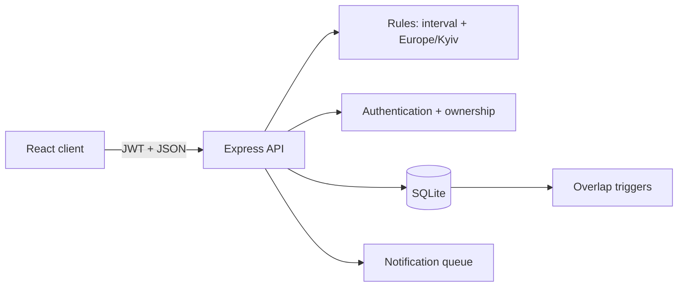

# Архітектурна карта RoomFlow

[English](ARCHITECTURE.md) · **Українська**

Цей документ описує межі модулів і гарантії системи. Його мета — пояснити, де саме застосунок захищає дані, а не лише показати можливості інтерфейсу.



## Межі модулів

| Модуль | Відповідальність | Не робить |
| --- | --- | --- |
| `src/main.tsx` | UI-стан, доступні сценарії, локальне форматування часу | не визначає, чи можна створити бронювання |
| `src/server.ts` | HTTP-контракти, auth, ownership, транзакційна оркестрація | не дублює складну календарну математику |
| `src/rules.ts` | чисті правила інтервалів, робочих годин і повторів у `Europe/Kyiv` | не працює з HTTP або базою даних |
| `src/db.ts` | схема, additive-міграції, індекси та SQL-trigger-и | не залежить від UI |
| `src/seed.ts` | ідемпотентні дані для першого запуску і demo-flow | не змінює реальні записи користувача |

## Інваріанти даних

| Інваріант | Рівень захисту | Причина |
| --- | --- | --- |
| У кімнати не буває двох перехресних бронювань | SQL trigger на `INSERT` і `UPDATE` | захищає навіть паралельні HTTP-запити |
| Суміжні слоти дозволені | формула `start < existingEnd && end > existingStart` | 10:00–10:30 і 10:30–11:00 не конфліктують |
| Лише автор змінює або скасовує бронювання | JWT middleware + `WHERE id = ? AND user_id = ?` | не можна обійти UI прямим API-запитом |
| Усі повтори або створюються, або не створюються | одна SQLite-транзакція | немає частково створеної серії |
| Нагадування не дублюються | `UNIQUE(booking_id, kind)` | старт і handoff існують окремо, але кожен лише раз |

Інтеграційний тест одночасно надсилає два HTTP-запити на той самий слот і перевіряє результат `201 + 409` та рівно один запис у базі. Це перевіряє фінальний SQL-захист, а не лише клієнтську валідацію.

## Час і часові пояси

База зберігає `starts_at` та `ends_at` як ISO UTC. Сервер перевіряє правила офісу у `Europe/Kyiv`, а клієнт відображає календар у часовому поясі браузера. Повторювана серія розраховується за офісним wall-clock time, тому не зсувається на годину через DST.

## Життєвий цикл бронювання

1. Клієнт надсилає кімнату, часовий інтервал і заголовок.
2. API валідовує auth, email verification, 30-хвилинну сітку, робочі години і майбутній час.
3. Для серії API спочатку перевіряє кожен тиждень, потім виконує один transaction.
4. SQLite trigger є фінальною конкурентно-безпечною перевіркою накладки.
5. Відповідь `201`, `400`, `403`, `404` або `409` дає клієнту однозначний стан для UI.

## Доставка та відтворюваність

- Node 22 зафіксований у `.nvmrc` і `package.json`.
- GitHub Actions виконує `npm ci`, тести та production build на кожному push/PR.
- Docker image збирається у дві стадії, запускається від непривілейованого користувача та має `/api/health` healthcheck.
- `JWT_SECRET` обов’язковий у production; для local development створюється випадковий локальний secret, який не є загальновідомою константою.

## Спостережуваність

У runtime кожен HTTP-запит отримує `X-Request-ID`, а сервер пише структурований JSON у stdout: method, path без query string, status і duration. Помилки мають окрему подію з correlation ID; паролі, JWT, headers, query-параметри та verification URL ніколи не логуються. У Docker потік доступний через `docker compose logs -f roomflow`.

## Свідомі межі

SQLite обрано для легкого автономного запуску однієї офісної інсталяції. Якщо система стане багатосерверною, природний наступний крок — PostgreSQL, окремий worker для нагадувань і push/SSE-канал. Поточні API-контракти та UTC-модель не залежать від SQLite, тому така заміна не потребує переписування клієнта.

## Швидка перевірка

```bash
npm ci
npm test
npm run build
docker compose config
```

## Презентаційна версія EN / УК

Основна мова — англійська. Перекладач міститься в src/translations.ts, перемикач мови — в src/i18n.tsx. API обирає мову повідомлень за Accept-Language. Навігація тижнями використовує календарні дні та перевірена на переходах DST. Сесійний JWT містить тільки дозволені поля й purpose=session; токен підтвердження email не приймається як сесія.

Демо-акаунти та відкритий розклад залишено для презентації. Посилання підтвердження показується без надсилання листа, діє 24 години й не є одноразовим. Ці механізми працюють і в Docker; для реального розгортання потрібні окремі заходи захисту.
